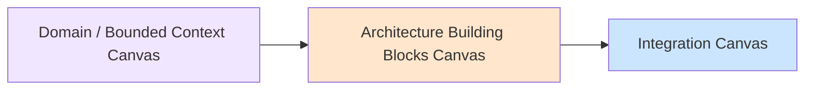
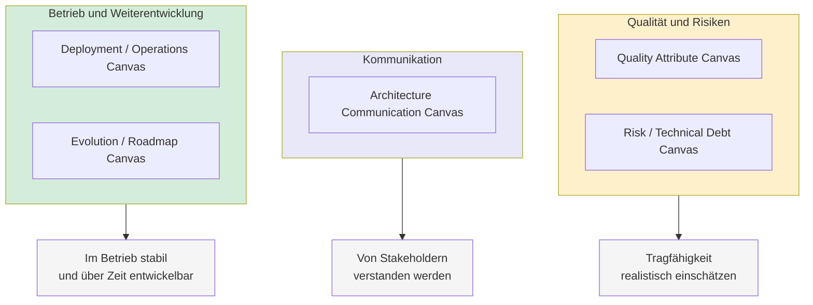
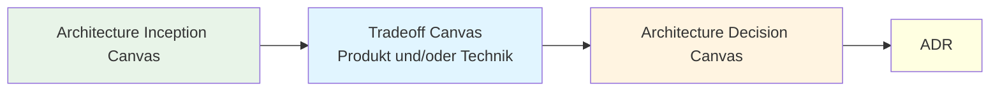
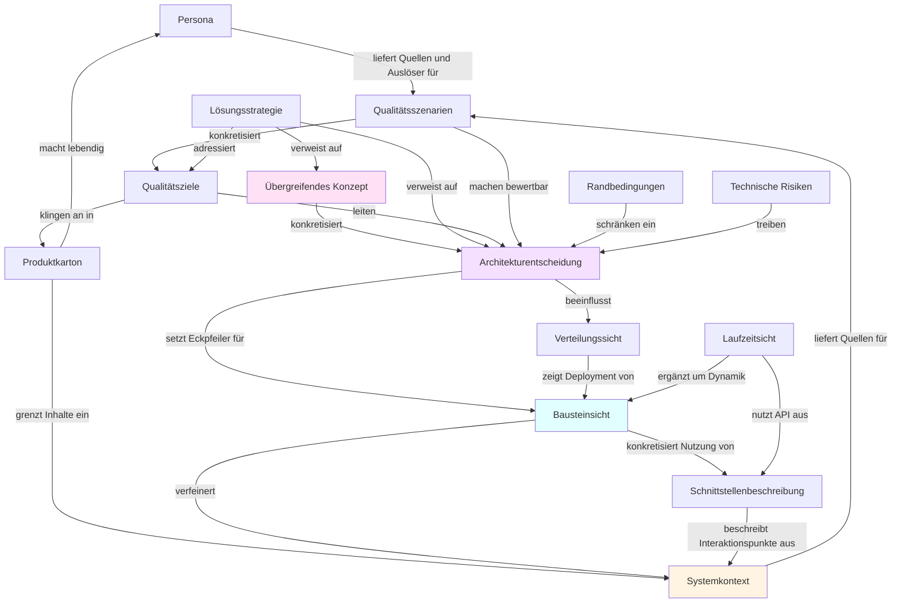

# Artefakt-Zusammenhänge: Architektur

Dieses Dokument beschreibt **Architekturdokumentation** im Sinne von **arc42** und gängiger Praxis, die **Canvas** dieser Bibliothek und **Entscheidungsketten** (Tradeoff → Architecture Decision Canvas → ADR). Es ist bewusst von der **Lieferkette** getrennt; die findet sich in **[artefakt-zusammenhaenge-delivery.md](artefakt-zusammenhaenge-delivery.md)**.

**Einstieg und Übersicht:** [artefakt-zusammenhaenge.md](artefakt-zusammenhaenge.md)

---

## Abhängigkeitskette der Dokumentationsmittel

Die folgende Abhängigkeitskette beschreibt, wie **Dokumentationsmittel** in der Architekturdokumentation typischerweise zusammenspielen (anschlussfähig an **arc42** und vergleichbare Leitfäden).

Die **nummerierte Liste** unten ist eine **didaktisch linear verkürzte Lesereihenfolge** — gut, um den Einstieg zu strukturieren. **Darüber hinaus** definiert diese **Prompt-Bibliothek** ein **Metamodell** als **Netz**: mehrere Mittel wirken **parallel und direkt** auf **Architekturentscheidungen** (z. B. Randbedingungen, technische Risiken, Qualitätsziele, Qualitätsszenarien). Dieses Netz ist die **konsolidierte Sicht dieser Prompt-Bibliothek** — bewusst **kompatibel** mit arc42 und üblicher Architekturdokumentation, aber **keine** wörtliche Abbildung eines einzelnen Fremdwerks. Die **Visualisierung weiter unten** stellt dieses **Bibliotheks-Metamodell** mit **beschrifteten Kanten** dar.

### Die Abhängigkeitskette

**1. Personas + Produktkarton → Systemkontext**
- Nutzer, Nutzenversprechen und Systemidee bestimmen, welche externen Akteure und Nachbarsysteme relevant sind.

**2. Systemkontext → Qualitätsziele & Qualitätsszenarien**
- Umfeld und Nutzung treiben die nicht-funktionalen Anforderungen.

**3. Qualitätsziele + Randbedingungen + Risiken → Lösungsstrategie**
- Qualitätsanforderungen, feste Vorgaben und erkannte Risiken bestimmen die grobe architektonische Richtung.

**4. Lösungsstrategie → Architekturentscheidungen**
- Die Strategie wird durch konkrete, begründete Entscheidungen (ADRs) verbindlich gemacht.

**5. Architekturentscheidungen → Bausteinsicht**
- Entscheidungen formen die statische Struktur (Komponenten, Schichten, Verantwortlichkeiten).

**6. Bausteinsicht → Schnittstellenbeschreibungen**
- Aus den Bausteinen ergeben sich ihre Interfaces und Verträge.

**7. Bausteinsicht + Architekturentscheidungen → Laufzeitsicht**
- Struktur und Designentscheidungen bestimmen die Interaktionen und Abläufe zur Laufzeit.

**8. Bausteinsicht + Laufzeitsicht → Verteilungssicht**
- Struktur und Laufzeitverhalten bestimmen das Deployment auf Infrastruktur.

**9. Übergreifende Konzepte → alle Sichten**
- Querschnittsthemen (z. B. Security, Logging, Fehlerbehandlung) wirken auf Baustein-, Laufzeit- und Verteilungssicht.

**10. Glossar → alle Dokumentationsmittel**
- Sichert einheitliche Begriffe über alle Artefakte hinweg.

### Kurzform

**Verständnisartefakte → Qualitäts- & Rahmen-Treiber → Strategie → Entscheidungen → Struktur → Schnittstellen & Verhalten → Verteilung** — mit Querschnittskonzepten und Glossar über allem.

### Verbindung zu unserem Workflow (arc42 vs. Lieferkette)

Die **Abhängigkeitskette** oben beschreibt **Dokumentationsmittel der Architekturdokumentation** (arc42-nahe). **arc42** ist das Template für **`{SOFTWARE-ARCHITECTURE.MD}`** und die **übergreifende** Architekturbeschreibung — **ohne** User Stories, Tasks oder Feature-Spezifikation als Kapitel.

**Liefer-Artefakte** (Anforderungen als fachliche Eingabe, User Stories, **Feature-Spezifikation**, Tasks, Code) gehören zum **Delivery-Workflow** und sind im **[Delivery-Dokument](artefakt-zusammenhaenge-delivery.md)** beschrieben. Sie **verknüpfen** sich mit der Architektur über **Verweise** (z. B. **ADRs**, Verweise auf arc42-Abschnitte, Leitplanken in der Feature-Spezifikation) — ersetzen arc42 aber **nicht**.

**Mapping der Dokumentationsmittel** (nur Architektur-seitig, vereinfacht):

- **Personas + Produktkarton** → entsprechen typisch der **Vision** (`{VISION.MD}`)
- **Systemkontext** → wird in **Anforderungen** (`{REQUIREMENTS.MD}`) und **arc42 Kapitel 3** dokumentiert
- **Qualitätsziele & Qualitätsszenarien** → sind Teil der **Anforderungen** (NFR) und von **arc42** (Qualitätsziele / Szenarien)
- **Lösungsstrategie** → **arc42 Kapitel 4** in `{SOFTWARE-ARCHITECTURE.MD}` — **Gesamtrichtung** des Systems (**kein** Ersatz durch Einzelfeatures)
- **Architekturentscheidungen** → **ADRs** (`{ADR}/`), entspricht arc42 Kapitel 9
- **Bausteinsicht, Laufzeitsicht, Verteilungssicht** → **arc42** (`{SOFTWARE-ARCHITECTURE.MD}`)
- **Schnittstellenbeschreibungen** (über das einzelne Feature hinaus, verbindlich für das System) → **arc42** (und ggf. API-/Vertragsdokumentation). **Feature-Spezifikationen** halten oft **feature-lokale** Schnittstellen/Annahmen fest und **verweisen** auf die kanonische Darstellung in arc42

**Feature-Spezifikation** (`{FEATURES}/`): **Lieferartefakt** — technische Ausarbeitung **pro** Liefergegenstand (Akzeptanzkriterien, Umsetzung, **Verweise auf ADRs**). Sie ist **kein** arc42-Kapitel; sie soll mit **Lösungsstrategie** und Sichten **konsistent** sein, ohne die Gesamtarchitektur in jedem Feature vollständig zu **duplizieren**.

**Bestands- und Wartungsprojekte:** Die nummerierte Kette ist **kein** Pflichtablauf. Praxisnah werden **Systemkontext**, **Bausteinsicht**, **Integration** oder **ADRs** oft aus **Code, Betrieb und Incidents** heraus befüllt und später mit Canvas und arc42 **nachgezogen**. Passt besonders gut mit dem **Evolution / Roadmap Canvas**, wenn Ist-Stand, Schulden und Zielbild **über Zeit** zusammengehören.

**Abgrenzung:** **Team-Schnitt, Conway’s Law und Zuständigkeiten pro Bounded Context** werden hier nur **implizit** über Rollen angedeutet. Wer organisationale Grenzen **explizit** zur Architektur spiegeln will, ergänzt das in eigenen Workshops oder Artefakten — diese Zusammenhänge-Doku legt den Fokus auf **Dokumentationsmittel und Canvas**.

Wie **Anforderungen**, **User Stories**, **Feature-Spezifikation**, **Tasks**, **Tests** und **Rückverfolgbarkeit** im Alltag zusammenspielen, steht kompakt in **[artefakt-zusammenhaenge-delivery.md](artefakt-zusammenhaenge-delivery.md)**. Ein **Diagramm**, das arc42 mit diesem Workflow verknüpft, ist dort ebenfalls abgebildet.

### Architecture Inception Canvas

Der **Architecture Inception Canvas** steht typischerweise **ganz am Anfang** eines neuen Vorhabens oder bei großer Unklarheit zu Zielen und Rahmen. Er schafft ein **gemeinsames Verständnis** über Problem, Ziele, Stakeholder und Randbedingungen — **bevor** konkrete Architekturentscheidungen oder ausgearbeitete arc42-Dokumentation im Fokus stehen. Umfang bewusst knapp (oft 1–2 Seiten), ohne Detailarchitektur.

**Typischer Anschluss:** Inhalte fließen in **Vision**, **Anforderungen** und die frühen arc42-Kapitel (u. a. Stakeholder, Randbedingungen, Kontext) ein. Sobald das betrachtete System **benennbar** ist, lohnt oft ein **System Context Canvas** für Grenze und Nachbarschaft. Ist das System **fachlich heterogen**, folgt häufig ein **Domain / Bounded Context Canvas** (strategische DDD-Aufteilung). Wenn mehrere Lösungsoptionen oder harte Zielkonflikte sichtbar werden, schließen sich **Tradeoff Canvas**, **Architecture Decision Canvas** und **ADR** an (siehe unten).

Vorlage: `{PROMPT}/artefakte/architecture-inception-canvas.md`.

### System Context Canvas

Der **System Context Canvas** fokussiert die **Kontextebene** eines bestehenden oder geplanten Systems: Akteure, externe Nachbarsysteme, Schnittstellen, Datenflüsse und eine klare **Innen-/Außen-Grenze**. Er ist **kein** Ersatz für die vollständige arc42-Kontextbeschreibung, liefert aber eine **kompakte, workshop-taugliche** Grundlage und passt zu **C4 Level 1** bzw. **arc42 Kapitel 3 (Kontext und Abgrenzung)**.

Typische Reihenfolge: oft **nach** oder **parallel** zur Inception, wenn das Vorhaben genug Kontur hat, um „unser System“ vs. „Umwelt“ sinnvoll zu benennen — oder bei **Brownfield**, wenn das Umfeld neu kartiert werden muss.

Vorlage: `{PROMPT}/artefakte/system-context-canvas.md`.

### Domain / Bounded Context Canvas

Der **Domain / Bounded Context Canvas** dient der **fachlichen Strukturierung** nach **Domain-Driven Design**: **Domänen**, **Bounded Contexts** mit klaren **Verantwortlichkeiten**, **Beziehungen** (z. B. Upstream/Downstream), **Integrationstypen** auf Modell-Ebene sowie **Ubiquitous Language** und typische **Schnittstellen zwischen Sprachen**. Er zielt **nicht** auf technische Zerlegung (Services, Deployments), sondern auf ein geteiltes **Fachmodell** und tragfähige **Grenzen**.

Typische Reihenfolge: **nach** dem **System Context Canvas**, wenn klar ist, was „unser System“ ist, aber **innen** noch mehrere fachliche Modelle oder organisatorische Schnitte existieren. Ergebnisse fließen in **arc42** (u. a. Bausteine, Schnittstellen) und in **Feature-Spezifikationen** ein; Spannungen zwischen Kontexten können **Tradeoff Canvas Technik** und **ADRs** (Integrationsmuster) auslösen.

Vorlage: `{PROMPT}/artefakte/domain-bounded-context-canvas.md`.

### Architecture Building Blocks Canvas

Der **Architecture Building Blocks Canvas** adressiert die **technische Grobstruktur** **innerhalb** der Systemgrenze: **Bausteine (Komponenten)**, **Verantwortlichkeiten**, **Schnittstellen** (APIs, Events, Datenflüsse), **Daten-Ownership**, **Abhängigkeiten** und **Hotspots**. Er steht **unterhalb** der reinen Kontextebene und **ergänzt** die **fachliche** Zerlegung aus dem Domain Canvas — Mapping zwischen Bounded Context und Baustein ist oft **n:1** oder **1:n** und soll **bewusst** dokumentiert werden.

Typische Reihenfolge: **nach** **System Context** und idealerweise mit Input aus **Domain / Bounded Context Canvas**, bevor die **arc42-Bausteinsicht** (Kapitel 5) und **C4**-Container/Component-Diagramme ausformuliert werden. Ergebnisse stützen **Feature-Spezifikationen**; Spannungen an Schnittstellen können **Tradeoff Canvas Technik** und **ADRs** auslösen.

Vorlage: `{PROMPT}/artefakte/architecture-building-blocks-canvas.md`.

### Integration Canvas

Der **Integration Canvas** vertieft die Frage, **wie** Systeme und Bausteine **technisch und betrieblich** zusammenspielen: **Integrationspartner** mit Rolle (Producer/Consumer), **Integrationsarten** (synchron, asynchron, Batch, Streaming), **Datenflüsse** inklusive grober Lastannahmen, **Kopplung** (lose vs. eng, zeitliche Abhängigkeit), **Fehler- und Resilienzstrategien** sowie **Risiken** und Bottlenecks. Er ergänzt den **System Context Canvas** (wer außen anbindet) und den **Architecture Building Blocks Canvas** (innere Bausteine und deren Schnittstellen), indem er **Verbindungen und Betriebsszenarien** bündelt.

Typische Reihenfolge: wenn **Kontext** und **Bausteine** grob stehen, aber noch Klärungsbedarf zu **Protokollen**, **Messaging**, **SLA** oder **Ausfallverhalten** besteht. Ergebnisse fließen in **arc42** (u. a. Laufzeitsicht, Schnittstellen) und in **ADRs**; offene Technologieentscheidungen bewusst **nicht** im Canvas „festnageln“, sondern per **Tradeoff Canvas Technik** oder ADR klären.

Vorlage: `{PROMPT}/artefakte/integration-canvas.md`.

### Domain, Building Blocks und Integration: drei Linsen auf dasselbe System

Die Architektur-**Canvas** in dieser Bibliothek sind **keine isolierten Einzelwerkzeuge**. Sie **ergänzen** sich und bauen **logisch** aufeinander auf: Jeder Canvas beleuchtet eine **andere Perspektive** auf dasselbe System — wie **verschiedene Linsen**, durch die man es nacheinander schärft.

**Für die Kette aus fachlicher Struktur, technischer Zerlegung und Zusammenspiel** eignet sich folgende **Denkreihenfolge** (nachdem klar ist, **welches** System betrachtet wird und wo die **äußere Grenze** liegt — dafür sind **Architecture Inception Canvas** und **System Context Canvas** typischerweise die passende **Vorbereitung**):

1. **Domain / Bounded Context Canvas** — **fachliche Sicht:** Welche **Domänen** und **Bounded Contexts** gibt es, welche **Verantwortlichkeiten** und **sinnvollen Grenzen**? Ziel ist **fachliche Struktur**, **unabhängig** von konkreten Technikentscheidungen.

2. **Architecture Building Blocks Canvas** — **technische Struktur:** Welche **Bausteine oder Komponenten** gibt es, welche **Aufgaben** übernehmen sie, wie sind **Verantwortlichkeiten** verteilt? Die fachliche Zerlegung wird in **konkrete Systemteile** übersetzt (Mapping n:1 oder 1:n bewusst dokumentieren).

3. **Integration Canvas** — **Interaktion und Vernetzung:** Wie arbeiten diese Bausteine **miteinander** und mit **Nachbarsystemen** zusammen? Sichtbar werden **Schnittstellen**, **Datenflüsse**, **synchrone vs. asynchrone** Kommunikation und damit das System als **Netzwerk** von Teilen.

**Kurz die Leitfragen:**

| Canvas | Zentrale Frage |
|--------|----------------|
| **Domain / Bounded Context** | Wie ist das Problem **fachlich** strukturiert? |
| **Architecture Building Blocks** | Wie setzen wir diese Struktur **technisch** um? |
| **Integration** | Wie **arbeiten die Teile zusammen**? |

**Merksatz:** **Fachliche Struktur → technische Struktur → Interaktion** — oder: **Was gehört zusammen → wie bauen wir es → wie verbindet sich alles.**

**Nutzen:** Man kann **Problemstellungen sauber trennen** — fachliche Modellierung, technische Zerlegung und Integrationsdesign **nacheinander** statt alles in einem Schritt zu vermischen. Das reduziert das Risiko, zu früh Technik zu wählen oder fachliche Grenzen an Deployments zu „verkleben“.

### Überblick: Absicherung, Betrieb, Kommunikation und Weiterentwicklung

Die folgenden Canvas ergänzen **Design- und Entscheidungs-Artefakte** (Inception, Kontext, Bausteine, Integration, Tradeoffs, ADRs) um eine Perspektive, die in **arc42** stark in den Kapiteln zu **Qualität**, **Risiken**, **Verteilung/Betrieb** und der **Erzählung** der Architektur vorkommt: *Funktioniert das System in der Praxis, und verstehen es die Beteiligten? Wie bleibt es über die Zeit handhabbar?*

#### Qualität und Risiken

Der **Quality Attribute Canvas** beantwortet die Frage, **wie gut** das System bestimmte Eigenschaften erfüllen muss — etwa Performance, Skalierbarkeit, Verfügbarkeit oder Sicherheit. Er hilft, diese Anforderungen nicht nur zu **benennen**, sondern zu **priorisieren** und in **Szenarien** zu konkretisieren; dabei werden **Zielkonflikte** sichtbar (z. B. hohe Performance vs. starke Konsistenz).

Der **Risk / Technical Debt Canvas** ergänzt das um **Risiken** und **technische Schulden**: bewusste oder unbewusste Kompromisse in der Architektur, mögliche **Folgen** von Entscheidungen und **Priorisierung** von Gegenmaßnahmen.

**Zusammen** liefern beide eine **realistische Einschätzung und Absicherung** der Architektur — passend zu arc42-Qualitätszielen und zum Risikokapitel.

#### Kommunikation

Der **Architecture Communication Canvas** zielt nicht auf die technische Zeichnung allein, sondern darauf, **wie** die Architektur **verschiedenen Zielgruppen** erklärt wird: welche **Botschaften** zählen, welche **Sichten** gezeigt werden und wie komplexe Inhalte **verständlich** vermittelt werden. So wird sichergestellt, dass Architektur **nicht nur existiert, sondern auch verstanden wird**.

#### Betrieb und Weiterentwicklung

Der **Deployment / Operations Canvas** richtet den Blick auf den **laufenden Betrieb**: Deployment und Umgebungen, **Skalierung**, **Monitoring**, **Verfügbarkeit** und Umgang mit **Ausfällen**. Damit wird sichtbar, ob die Architektur im Alltag **stabil und betreibbar** ist.

Der **Evolution / Roadmap Canvas** blickt **voraus**: vom **Ist-Zustand** zum **Zielbild**, mit **Zwischenstufen**, **Abhängigkeiten** und **Risiken** der Transformation — bewusst **evolutionär**, ohne Big-Bang als Standardannahme.

**Zusammen** unterstützen beide, die Architektur **langfristig tragfähig** zu machen (Betrieb heute, Entwicklung morgen).

#### Mental model (Kurz)

| Cluster | Leitfrage | Canvas |
|--------|-----------|--------|
| Qualität und Risiken | Wie gut muss es sein, und wo droht Gefahr? | Quality Attribute, Risk / Technical Debt |
| Kommunikation | Wie erklären wir es, damit es ankommt? | Architecture Communication |
| Betrieb und Zeit | Wie betreiben wir es stabil, und wie entwickelt es sich weiter? | Deployment / Operations, Evolution / Roadmap |

**Gesamtzusammenhang:** **Qualität und Risiko** stützen die **Tragfähigkeit**; **Kommunikation** die **Verständlichkeit**; **Betrieb und Evolution** die **Nutzbarkeit über Zeit und im Tagesgeschäft**.

> **Funktioniert es gut?** → Quality Attribute Canvas.  
> **Was kann schiefgehen?** → Risk / Technical Debt Canvas.  
> **Versteht es jede Zielgruppe?** → Architecture Communication Canvas.  
> **Läuft es stabil im Betrieb?** → Deployment / Operations Canvas.  
> **Bleibt es zukunftsfähig?** → Evolution / Roadmap Canvas.

Vorlagen: `{PROMPT}/artefakte/quality-attribute-canvas.md`, `{PROMPT}/artefakte/risk-technical-debt-canvas.md`, `{PROMPT}/artefakte/architecture-communication-canvas.md`, `{PROMPT}/artefakte/deployment-operations-canvas.md`, `{PROMPT}/artefakte/evolution-roadmap-canvas.md`.

### Quality Attribute Canvas

Der **Quality Attribute Canvas** ist eine **querliegende Linse** auf **Qualität** und **nicht-funktionale Anforderungen**: welche *-ilities* **zählen**, wie sie **priorisiert** werden, wie sie sich in **konkreten Szenarien** (Stimulus–Reaktion–Maß) ausdrücken, wo **Zielkonflikte** entstehen und welche **Risiken** bei Nichterreichen drohen. Er ergänzt die strukturellen Canvas (Domain, Building Blocks, Integration) — denn dieselbe Zerlegung kann unterschiedliche Qualitätsziele **unterschiedlich stark** belasten.

Typische **Eingaben:** **Anforderungen** (`{REQUIREMENTS.MD}`), **Inception** (Ziele, Randbedingungen) und Stimmen aus **Betrieb** oder **Sicherheit**. **Ausgabe:** Übernahme in **arc42 Kapitel 1.2** und Qualitätsszenarien, Verankerung in **Feature-Spezifikationen**; bei harten Spannungen **Tradeoff Canvas Technik** und **ADRs**.

Vorlage: `{PROMPT}/artefakte/quality-attribute-canvas.md`.

### Risk / Technical Debt Canvas

Der **Risk / Technical Debt Canvas** fasst **Risiken** (technisch, organisatorisch, Integration) und **technische Schulden** zusammen: **Ursachen**, mögliche **Auswirkungen**, grobe **Wahrscheinlichkeit** und **Impact**, **Maßnahmen** (Vermeidung, Reduktion, Monitoring) sowie eine **priorisierte** Übersicht. Er ist bewusst **ehrlich** gedacht — ohne Beschönigung — und macht **implizite** Risiken und **still akzeptierte** Kompromisse sichtbar.

Typische **Eingaben:** Erkenntnisse aus **Quality Attribute Canvas** (was passiert bei Nichterreichen), **Integration Canvas**, **Feature-Umsetzung**, **Inception** und Betrieb/Incidents. **Ausgabe:** Pflege in **arc42** (Risiken), Einbindung in **Backlog** und **Feature-Spezifikationen**, bei strategischen Themen **ADRs** oder **Tradeoff Canvas Technik**.

Vorlage: `{PROMPT}/artefakte/risk-technical-debt-canvas.md`.

### Architecture Communication Canvas

Der **Architecture Communication Canvas** adressiert **nicht den Inhalt** der Architektur allein, sondern **wie** er **zielgruppengerecht** vermittelt wird: **Zielgruppen** und ihre Bedürfnisse, **Kernbotschaften** („was soll hängen bleiben?“), **relevante Sichten** (Kontext, Bausteine, Datenflüsse, …), **Kommunikationsmittel** (Diagramme, Dokumente, Präsentationen), **bewusste Vereinfachung** sowie **Risiken** der Kommunikation (Missverständnisse, falsche Erwartungen). Er **ergänzt** arc42 und die übrigen Canvas, indem er eine **Kommunikationsstrategie** pro Anlass strukturiert.

Typische **Eingabe:** bestehende oder geplante Darstellung in **`{SOFTWARE-ARCHITECTURE.MD}`**, **System Context** / **C4**-Material, ADR-Kurzüberblicke. **Ausgabe:** abgestimmte **Storyline** und Mittelwahl für Reviews, Onboarding, Management oder Fachbereich.

Vorlage: `{PROMPT}/artefakte/architecture-communication-canvas.md`.

### Deployment / Operations Canvas

Der **Deployment / Operations Canvas** fasst die **operative Realität** zusammen: **wo** und **wie** Software läuft (Deployment-Struktur, Umgebungen, Cluster/Nodes), **Skalierung** und Engpässe, **Logging, Monitoring und Alerting**, **Verfügbarkeit und Resilienz** (Redundanz, Failover, Recovery), **Betriebsaufwand** (Komplexität, erforderliche Skills) sowie **betriebliche Risiken** und Single Points of Failure. Er ist bewusst **nicht** als idealisiertes Architekturplakat gedacht, sondern als **ehrliche** Grundlage für Architektur, **Systemhandbuch** und **Betriebshandbuch**.

Typische **Eingaben:** **Integration Canvas** (Laufzeit und Schnittstellen), **Architecture Building Blocks** (was deployed wird), **Quality Attribute Canvas** (SLAs, Verfügbarkeit). **Rollen:** Softwarearchitekt und **Operativer Betrieb** sollten **gemeinsam** daran arbeiten.

Vorlage: `{PROMPT}/artefakte/deployment-operations-canvas.md`.

### Evolution / Roadmap Canvas

Der **Evolution / Roadmap Canvas** plant die **schrittweise Weiterentwicklung** der Architektur: **Ausgangslage** und Probleme, **Zielbild**, **sinnvolle Zwischenstufen** mit Reihenfolge, **Migrationsweg** inklusive Transformationsrisiken, **Abhängigkeiten** und typische **Stolpersteine**. Er ist auf **evolutionäre** Änderungen ausgelegt — **kein** Standard-Big-Bang; große Sprünge nur mit **expliziter** Begründung und Risikohinweis.

Typische **Eingaben:** aktueller **arc42**-Stand, **Risk / Technical Debt Canvas**, **Inception**-Ziele, Abstimmung mit **Product Owner** (Lieferrhythmus). **Ausgabe:** Meilensteine, die in **ADRs**, **Feature-Spezifikationen** und die **Architekturdokumentation** einfließen; **Communication Canvas** kann die Erzählung pro Stakeholdergruppe unterstützen.

Vorlage: `{PROMPT}/artefakte/evolution-roadmap-canvas.md`.

### Tradeoff Canvas, Architecture Decision Canvas und ADR

In der Architektur- und Produktarbeit erfüllen **Trade-off Canvas**, **Architecture Decision Canvas** und **Architecture Decision Record (ADR)** unterschiedliche, aber zusammenhängende Rollen **innerhalb desselben Entscheidungsprozesses** — oft **nach** einer ersten Inception- oder Kontextklärung. Nicht jede Entscheidung braucht alle Schritte: Bei kleinen oder eindeutigen Themen kann ein ADR ausreichen; bei komplexen oder teamübergreifenden Fragen lohnt sich der gesamte Verlauf inklusive Inception.

#### 1. Trade-off Canvas — Optionen verstehen und vergleichen

Typischerweise steht am Anfang (oder parallel zur Klärung des Problems) der **Trade-off Canvas**. Er dient dazu, **Lösungs- oder Prioritätsoptionen strukturiert** miteinander zu vergleichen. Dabei werden insbesondere **Unterschiede und Zielkonflikte** sichtbar: was eine Option bringt und was man dafür in Kauf nimmt. Ziel ist in dieser Phase noch nicht zwingend die finale Entscheidung, sondern ein **gemeinsames Verständnis der Optionen und Tradeoffs**.

In dieser Bibliothek gibt es dafür **zwei Vorlagen** (je nach Art der Spannung):

| Artefakt | Zuständigkeit | Fokus |
|----------|----------------|--------|
| **Tradeoff Canvas Produkt** | Product Owner | Scope, Termin, Nutzerwert, Risiko, Lieferfähigkeit u. a. |
| **Tradeoff Canvas Technik** | Softwarearchitekt | Qualitätsattribute, Betrieb, Komplexität, technische Varianten |

Überschneidungen (z. B. „Termin vs. technische Qualität“) können **beide Canvas** nacheinander oder in einer gemeinsamen Session sinnvoll sein.

Vorlagen: `{PROMPT}/artefakte/tradeoff-canvas-produkt.md`, `{PROMPT}/artefakte/tradeoff-canvas-technik.md`.

#### 2. Architecture Decision Canvas — entscheiden und begründen

Darauf aufbauend (oder bei klarer Optionenlage von dort startend) kommt der **Architecture Decision Canvas** zum Einsatz. Hier wird die **eigentliche Entscheidung vorbereitet und getroffen**: das Problem wird präzise formuliert, **relevante Kriterien** werden festgelegt, die Optionen werden **entlang dieser Kriterien bewertet**, und am Ende steht eine **konkrete, begründete Entscheidung** inklusive Konsequenzen und Nicht-Zielen.

Vorlage: `{PROMPT}/artefakte/architecture-decision-canvas.md`.

#### 3. ADR — dauerhaft festhalten

Das Ergebnis wird anschließend in einem **Architecture Decision Record (ADR)** festgehalten. Der ADR ist die **kompakte, langfristige Dokumentation** der Entscheidung mit Kontext, Begründung und Konsequenzen — nachvollziehbar für **später Einstiegende** und für alle, die nicht in der ursprünglichen Diskussion dabei waren. Ablage im Projekt typischerweise unter `{DOCS}/{ADR}/`.

Vorlage: `{PROMPT}/artefakte/architecture-decision-record.md`.

#### Kurz zusammengefasst

- **Trade-off Canvas:** Optionen und Zielkonflikte **verstehen** und vergleichen.  
- **Architecture Decision Canvas:** Entscheidung **vorbereiten, treffen und begründen**.  
- **ADR:** Ergebnis **dauerhaft und knapp dokumentieren**.

Noch kürzer: **Erst das Vorhaben verorten, dann Optionen verstehen, dann entscheiden, dann dokumentieren.**

### Visualisierung der Abhängigkeitskette

Das Diagramm zeigt das **Metamodell dieser Bibliothek**: **Architekturentscheidung** als Zentralpunkt, **beschriftete Kanten** zwischen den Dokumentationsmitteln. Es bildet **ausschließlich** die Ebene der **Architekturdokumentation** ab — **ohne** User Stories, Tasks, Testpläne oder QA als Knoten. Wer **Lieferkette und Architektur in einem vereinfachten Gesamtbild** sehen will (bewusst **zwei Ebenen gemischt**), findet das im [Delivery-Dokument](artefakt-zusammenhaenge-delivery.md) im Abschnitt *Diagramm: arc42-Kette und praktischer Workflow*; die **reine** Lieferkette dort im Abschnitt *Workflow-Diagramm (Lieferung & QA)*.

Abweichungen der **nummerierten Liste** (weiter oben) zu diesem Netz sind u. a.: **Randbedingungen** und **technische Risiken** wirken **direkt** auf die Entscheidung (nicht nur über die Lösungsstrategie); **Übergreifende Konzepte konkretisieren** die Entscheidung; **Schnittstellenbeschreibung** ist aus dem **Systemkontext** begründet, die **Bausteinsicht konkretisiert deren Nutzung**; **Verteilungssicht** zeigt das **Deployment der Bausteinsicht**.

**Glossar** (in klassischen Übersichtsgrafiken oft zu allen Mitteln angedeutet): klärt wichtige Begriffe **über** Persona, Produktkarton, Kontext, Qualität, Strategie, Entscheidungen und Sichten hinweg — im Diagramm weggelassen, um Lesbarkeit zu wahren.
