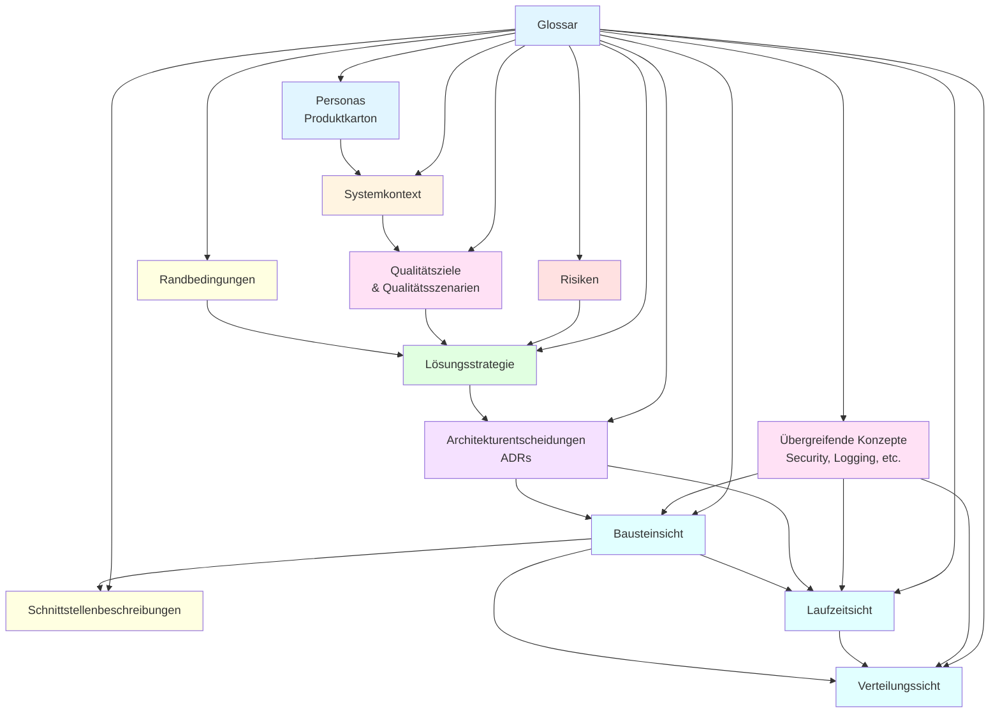
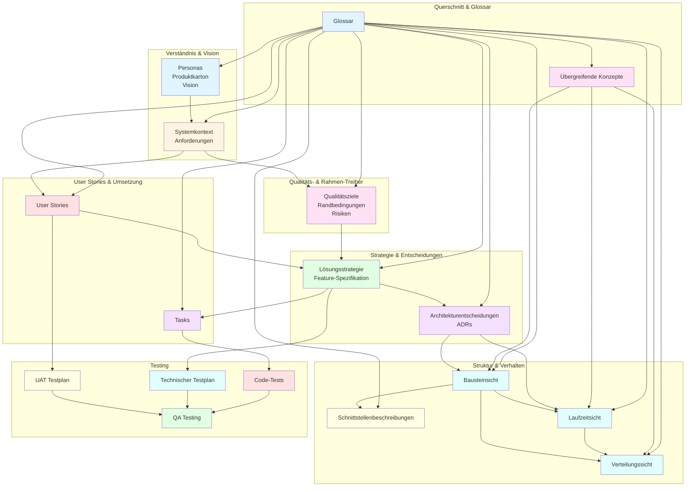

# Artefakt-Zusammenhänge

Diese Dokumentation erklärt die Zusammenhänge zwischen Anforderungen, User Stories, Feature-Spezifikationen, Testplänen und anderen Artefakten im Entwicklungsprozess.

---

## Abhängigkeitskette der Dokumentationsmittel (nach Stefan Zörner)

Basierend auf Stefan Zörners Buch "Softwarearchitekturen dokumentieren und kommunizieren" zeigt die folgende Abhängigkeitskette, wie verschiedene Dokumentationsmittel aufeinander aufbauen:

### Die Abhängigkeitskette

**1. Personas + Produktkarton → Systemkontext**
- Nutzer, Nutzenversprechen und Systemidee bestimmen, welche externen Akteure und Nachbarsysteme relevant sind.

**2. Systemkontext → Qualitätsziele & Qualitätsszenarien**
- Umfeld und Nutzung treiben die nicht-funktionalen Anforderungen.

**3. Qualitätsziele + Randbedingungen + Risiken → Lösungsstrategie**
- Qualitätsanforderungen, feste Vorgaben und erkannte Risiken bestimmen die grobe architektonische Richtung.

**4. Lösungsstrategie → Architekturentscheidungen**
- Die Strategie wird durch konkrete, begründete Entscheidungen (ADRs) verbindlich gemacht.

**5. Architekturentscheidungen → Bausteinsicht**
- Entscheidungen formen die statische Struktur (Komponenten, Schichten, Verantwortlichkeiten).

**6. Bausteinsicht → Schnittstellenbeschreibungen**
- Aus den Bausteinen ergeben sich ihre Interfaces und Verträge.

**7. Bausteinsicht + Architekturentscheidungen → Laufzeitsicht**
- Struktur und Designentscheidungen bestimmen die Interaktionen und Abläufe zur Laufzeit.

**8. Bausteinsicht + Laufzeitsicht → Verteilungssicht**
- Struktur und Laufzeitverhalten bestimmen das Deployment auf Infrastruktur.

**9. Übergreifende Konzepte → alle Sichten**
- Querschnittsthemen (z. B. Security, Logging, Fehlerbehandlung) wirken auf Baustein-, Laufzeit- und Verteilungssicht.

**10. Glossar → alle Dokumentationsmittel**
- Sichert einheitliche Begriffe über alle Artefakte hinweg.

### Kurzform

**Verständnisartefakte → Qualitäts- & Rahmen-Treiber → Strategie → Entscheidungen → Struktur → Schnittstellen & Verhalten → Verteilung** — mit Querschnittskonzepten und Glossar über allem.

### Verbindung zu unserem Workflow

Die arc42-Abhängigkeitskette passt zu unserem praktischen Workflow:

- **Personas + Produktkarton** → entsprechen unserer **Vision** (`{VISION.MD}`)
- **Systemkontext** → wird in **Anforderungen** (`{REQUIREMENTS.MD}`) und **arc42 Kapitel 3** dokumentiert
- **Qualitätsziele & Qualitätsszenarien** → sind Teil der **Anforderungen** (nicht-funktionale Anforderungen)
- **Lösungsstrategie** → wird in **Feature-Spezifikationen** (`{FEATURES}/`) und **arc42 Kapitel 4** dokumentiert
- **Architekturentscheidungen** → werden als **ADRs** (`{ADR}/`) dokumentiert (entspricht arc42 Kapitel 9)
- **Bausteinsicht, Laufzeitsicht, Verteilungssicht** → werden in **arc42** (`{SOFTWARE-ARCHITECTURE.MD}`) dokumentiert
- **Schnittstellenbeschreibungen** → sind Teil der **Feature-Spezifikationen** und **arc42**

### Visualisierung der Abhängigkeitskette



### Kombiniertes Diagramm: arc42-Abhängigkeitskette + Praktischer Workflow

Das folgende Diagramm zeigt, wie die arc42-Abhängigkeitskette mit unserem praktischen Workflow (Anforderungen → User Stories → Feature-Spezifikation → Tasks) zusammenhängt:



---

## Praktischer Workflow

In der Praxis läuft der Prozess folgendermaßen ab:

1. **Anforderungsmanager** definiert Anforderungen (strukturiert, mit REQ-IDs)
2. **Product Owner** kennt diese Anforderungen und erstellt User Stories (Mehrwert aus Nutzersicht)
3. **Architect + Dev Team** erstellen Feature-Spezifikation (technische Umsetzung)
4. **Tester/QA** definiert Testplan auf Basis der Feature-Spezifikation (und User Story)

**Hinweis:** In kleineren Teams kann der Product Owner auch die Rolle des Anforderungsmanagers übernehmen.

---

## 1. Anforderungen → User Stories → Feature-Spezifikation → Tasks

### Anforderungen (`{REQUIREMENTS.MD}`)

**Was:** Strukturierte Dokumentation aller Anforderungen (funktional, nicht-funktional, Randbedingungen)

**Wer:** Anforderungsmanager (oder Product Owner in kleineren Teams)

**Zweck:** Systematische Erfassung aller Anforderungen mit Priorisierung

**Enthält:**
- REQ-IDs (z.B. REQ-001, FUNC-001, QUAL-001, CONST-001)
- Beschreibungen
- Begründungen
- Prioritäten

**Beispiel:**
```
REQ-001: Als Nutzer kann ich mich anmelden
Typ: Funktional
Priorität: Hoch
Beschreibung: Nutzer können sich mit E-Mail und Passwort anmelden
```

**Verknüpfung:** Wird zu User Stories, verweist auf Vision

---

### User Stories (`{USER-STORIES}/`)

**Was:** Mehrwert-Beschreibung aus Nutzersicht

**Wer:** Product Owner

**Zweck:** Übersetzung von Anforderungen in nutzerzentrierte Stories

**Enthält:**
- Format: "Als [Rolle] möchte ich [Ziel], damit [Mehrwert]"
- Akzeptanzkriterien (aus Nutzersicht)
- Verknüpfung zu Anforderungen (REQ-IDs)

**Beispiel:**
```
US-001: Als Nutzer möchte ich mich mit E-Mail und Passwort anmelden, 
        damit ich auf meine Daten zugreifen kann.
        
Verknüpft mit: REQ-001

Akzeptanzkriterien (aus Nutzersicht):
- Nutzer kann sich mit gültigen Credentials anmelden
- Nach Anmeldung wird Dashboard angezeigt
- Bei ungültigen Credentials wird Fehlermeldung angezeigt
```

**Verknüpfung:** Leitet sich aus Anforderungen ab, verweist auf REQ-IDs, wird zu Feature-Spezifikation

---

### Feature-Spezifikation (`{FEATURES}/`)

**Was:** Technische Umsetzungsspezifikation

**Wer:** Softwarearchitekt + Entwicklerteam

**Zweck:** Detaillierte technische Beschreibung der Umsetzung

**Enthält:**
- Technische Anforderungen (Was ändert sich?)
- Architektur-Leitplanken (Wie wird es umgesetzt?)
- **Technische Akzeptanzkriterien** (Testbarkeit)
- Abhängigkeiten
- Risiken
- ADRs (Architecture Decision Records)

**Beispiel:**
```
Feature-001: User-Login-Implementierung

Verknüpft mit: US-001

Technische Anforderungen:
- Login-API Endpoint: POST /api/auth/login
- Datenbank: User-Tabelle mit E-Mail und Passwort-Hash
- Frontend: Login-Komponente

Architektur-Leitplanken:
- RESTful API Design
- JWT für Authentifizierung
- bcrypt für Password-Hashing

Technische Akzeptanzkriterien:
- Funktionale Tests: Login-API akzeptiert gültige Credentials → 200 OK + JWT Token
- Integration-Tests: Login-Flow: Frontend → API → Datenbank → Response
- Performance-Tests: Login-API antwortet innerhalb von 200ms (P95)
- Sicherheits-Tests: Passwort wird gehasht (bcrypt), Rate-Limiting aktiv
```

**Verknüpfung:** Basiert auf User Story, verweist auf User Story und ADRs, wird zu Tasks

---

### Tasks

**Was:** Konkrete Umsetzungsschritte

**Wer:** Entwicklerteam

**Zweck:** Umsetzbare Arbeitseinheiten

**Enthält:**
- Code-Änderungen
- Tests
- Dokumentation

**Beispiel:**
```
Task 1: Login-API Endpoint implementieren
Task 2: Datenbank-Schema erweitern
Task 3: Frontend Login-Komponente erstellen
Task 4: Unit Tests schreiben
Task 5: Integration Tests schreiben
```

**Verknüpfung:** Leitet sich aus Feature-Spezifikation ab, resultiert in Code

---

## 2. Testpläne und Akzeptanzkriterien

**Wichtig:** Testpläne sind nicht als separates Artefakt definiert, sondern sind Teil der verschiedenen Artefakte.

### In User Stories: Akzeptanzkriterien (aus Nutzersicht)

**Was:** Beschreibt, wann die User Story erfüllt ist (aus Nutzersicht)

**Wer:** Product Owner

**Zweck:** Definiert, wann die User Story als "fertig" gilt

**Beispiel:**
```
Akzeptanzkriterien:
- Nutzer kann sich mit gültigen Credentials anmelden
- Nach Anmeldung wird Dashboard angezeigt
- Bei ungültigen Credentials wird Fehlermeldung angezeigt
```

**Führt zu:** User Acceptance Tests (UAT)

---

### In Feature-Spezifikationen: Technische Akzeptanzkriterien

**Was:** Detaillierte Test-Spezifikationen

**Wer:** Softwarearchitekt + Entwicklerteam

**Zweck:** Beschreibt, wie technisch getestet wird

**Enthält:**
- **Funktionale Tests:** Was funktioniert?
- **Integration-Tests:** Wie funktioniert es zusammen?
- **Performance-Tests:** Wie schnell ist es?
- **Sicherheits-Tests:** Wie sicher ist es?

**Beispiel:**
```
Technische Akzeptanzkriterien:

Funktionale Tests:
- Login-API akzeptiert gültige Credentials → 200 OK + JWT Token
- Login-API lehnt ungültige Credentials ab → 401 Unauthorized

Integration-Tests:
- Login-Flow: Frontend → API → Datenbank → Response
- JWT Token wird korrekt generiert und validiert

Performance-Tests:
- Login-API antwortet innerhalb von 200ms (P95)
- System kann 1000 Login-Requests/Minute verarbeiten

Sicherheits-Tests:
- Passwort wird gehasht (bcrypt)
- Rate-Limiting aktiv (max 5 Versuche/Minute)
- JWT Token ist signiert und ablaufbar
```

**Führt zu:** Technische Tests (Unit, Integration, Performance, Security)

---

### Testpläne entstehen aus:

1. **User Story Akzeptanzkriterien** → User Acceptance Tests (UAT)
   - Testet aus Nutzersicht
   - Prüft, ob der Mehrwert geliefert wird
   - Wird von QA/PO geprüft

2. **Feature-Spezifikation technische Akzeptanzkriterien** → Technische Tests
   - Unit Tests (Entwickler)
   - Integration Tests (Entwickler + QA)
   - Performance Tests (QA)
   - Security Tests (QA + Security)

---

## 3. Rückverfolgbarkeit (Traceability)

Alle Artefakte sind miteinander verknüpft:

```
Vision ({VISION.MD})
  ↓
Anforderungen ({REQUIREMENTS.MD})
  REQ-001, REQ-002, ...
  ↓
User Stories ({USER-STORIES}/)
  US-001 → verweist auf REQ-001
  ↓
Feature-Spezifikation ({FEATURES}/)
  Feature-001 → verweist auf US-001
  ↓
Tasks (Task-Management)
  Task 1, Task 2, ... → verweisen auf Feature-001
  ↓
Code ({LANGUAGE}/)
  Code → verweist auf Tasks
```

### Vorteile der Rückverfolgbarkeit:

- **Änderungen können zurückverfolgt werden:** Wenn sich eine Anforderung ändert, kann man sehen, welche User Stories, Features und Tasks betroffen sind
- **Impact-Analyse möglich:** Bei Änderungen kann man den Impact auf andere Artefakte analysieren
- **Vollständigkeit kann geprüft werden:** Man kann prüfen, ob alle Anforderungen abgedeckt sind
- **Testabdeckung kann nachvollzogen werden:** Man kann sehen, welche Tests zu welchen Anforderungen gehören

---

## 4. Rollen-Verantwortlichkeiten für Tests

### Product Owner

**Verantwortlich für:**
- Definiert User Story Akzeptanzkriterien (aus Nutzersicht)
- Prüft User Acceptance Tests (UAT)
- Entscheidet, ob User Story erfüllt ist

**Nicht verantwortlich für:**
- Technische Test-Details
- Unit Tests
- Performance-Tests

---

### Softwarearchitekt

**Verantwortlich für:**
- Definiert technische Akzeptanzkriterien in Feature-Spezifikation
- Prüft Architektur-Konformität
- Führt Architektur-Reviews durch

**Nicht verantwortlich für:**
- User Story Akzeptanzkriterien (das ist PO-Aufgabe)
- Konkrete Test-Implementierung (das ist Team-Aufgabe)

---

### Entwicklerteam

**Verantwortlich für:**
- Schreibt Unit Tests basierend auf technischen Akzeptanzkriterien
- Schreibt Integration Tests
- Implementiert Code, der Tests erfüllt
- Führt Code-Reviews durch

**Nicht verantwortlich für:**
- User Story Akzeptanzkriterien (das ist PO-Aufgabe)
- Architektur-Leitplanken (das ist Architekt-Aufgabe)

---

### QA / Tester

**Verantwortlich für:**
- Erstellt Testpläne basierend auf:
  - **Feature-Spezifikation** (Hauptquelle für technische Tests)
  - User Story Akzeptanzkriterien (UAT)
  - Technischen Akzeptanzkriterien (Feature-Spezifikation)
- Führt Tests durch:
  - User Acceptance Tests (basierend auf User Story)
  - Integration Tests (basierend auf Feature-Spezifikation)
  - Performance Tests (basierend auf Feature-Spezifikation)
  - Security Tests (basierend auf Feature-Spezifikation)
- Prüft Definition of Done

**Wichtig:** Der Testplan sollte primär auf der Feature-Spezifikation basieren, da diese die technischen Akzeptanzkriterien enthält. Die User Story Akzeptanzkriterien werden für UAT verwendet.

**Nicht verantwortlich für:**
- User Story Definition (das ist PO-Aufgabe)
- Technische Spezifikation (das ist Architekt + Team-Aufgabe)

---

## 5. Kompletter Durchlauf: Beispiel

### Schritt 1: Anforderung

```
REQ-001: User-Login-Funktionalität
Typ: Funktional
Priorität: Hoch
Beschreibung: Nutzer können sich mit E-Mail und Passwort anmelden
Begründung: Ermöglicht personalisierten Zugriff auf Benutzerdaten
```

---

### Schritt 2: User Story

```
US-001: Als Nutzer möchte ich mich mit E-Mail und Passwort anmelden, 
        damit ich auf meine Daten zugreifen kann.
        
Verknüpft mit: REQ-001

Akzeptanzkriterien (aus Nutzersicht):
- Nutzer kann sich mit gültigen Credentials anmelden
- Nach Anmeldung wird Dashboard angezeigt
- Bei ungültigen Credentials wird Fehlermeldung angezeigt
```

---

### Schritt 3: Feature-Spezifikation

```
Feature-001: User-Login-Implementierung

Verknüpft mit: US-001

Technische Anforderungen:
- Login-API Endpoint: POST /api/auth/login
- Datenbank: User-Tabelle mit E-Mail und Passwort-Hash
- Frontend: Login-Komponente

Architektur-Leitplanken:
- RESTful API Design
- JWT für Authentifizierung
- bcrypt für Password-Hashing
- Rate-Limiting: max 5 Versuche/Minute

Technische Akzeptanzkriterien:
- Funktionale Tests:
  * Login-API akzeptiert gültige Credentials → 200 OK + JWT Token
  * Login-API lehnt ungültige Credentials ab → 401 Unauthorized
- Integration-Tests:
  * Login-Flow: Frontend → API → Datenbank → Response
- Performance-Tests:
  * Login-API antwortet innerhalb von 200ms (P95)
- Sicherheits-Tests:
  * Passwort wird gehasht (bcrypt)
  * Rate-Limiting aktiv (max 5 Versuche/Minute)
```

---

### Schritt 4: Tasks

```
Task 1: Login-API Endpoint implementieren
Task 2: Datenbank-Schema erweitern (User-Tabelle)
Task 3: Frontend Login-Komponente erstellen
Task 4: Unit Tests für Login-Service schreiben
Task 5: Integration Tests für Login-Flow schreiben
Task 6: Performance-Tests durchführen
Task 7: Security-Tests durchführen
```

---

### Schritt 5: Testpläne

#### UAT Testplan (aus User Story):

```
Test 1: Nutzer meldet sich mit gültigen Credentials an
- Erwartung: Dashboard wird angezeigt
- Status: [ ] Bestanden / [ ] Fehlgeschlagen

Test 2: Nutzer meldet sich mit ungültigen Credentials an
- Erwartung: Fehlermeldung wird angezeigt
- Status: [ ] Bestanden / [ ] Fehlgeschlagen
```

#### Technischer Testplan (aus Feature-Spezifikation):

```
Unit Tests:
- Login-Service: Password-Hashing funktioniert
- Login-Service: JWT-Generierung funktioniert
- Login-Service: Rate-Limiting funktioniert

Integration Tests:
- API-Endpoint: Login-Flow funktioniert end-to-end
- Datenbank: User-Daten werden korrekt gespeichert/abgerufen

Performance Tests:
- Response-Zeit < 200ms (P95)
- System kann 1000 Requests/Minute verarbeiten

Security Tests:
- Password-Hashing: bcrypt wird verwendet
- Rate-Limiting: Max 5 Versuche/Minute
- JWT Token: Signiert und ablaufbar
```

---

## 6. Workflow-Diagramm

```mermaid
flowchart TD
    A[Vision<br/>{VISION.MD}] --> B[Anforderungen<br/>{REQUIREMENTS.MD}<br/>REQ-001, REQ-002, ...]
    B --> C[User Stories<br/>{USER-STORIES}/<br/>US-001, US-002, ...]
    
    C --> D[Feature-Spezifikation<br/>{FEATURES}/<br/>Feature-001, ...]
    D --> E[Tasks<br/>Task-Management]
    E --> F[Code<br/>{LANGUAGE}/]
    
    C --> G[User Story<br/>Akzeptanzkriterien<br/>aus Nutzersicht]
    G --> H[UAT Testplan<br/>User Acceptance Tests]
    
    D --> I[Technische<br/>Akzeptanzkriterien<br/>Funktional, Integration,<br/>Performance, Security]
    I --> J[Technischer Testplan<br/>Unit, Integration,<br/>Performance, Security Tests]
    
    F --> K[Code-Tests<br/>Unit Tests,<br/>Integration Tests]
    
    H --> L[QA Testing<br/>Basierend auf<br/>beiden Testplänen]
    J --> L
    K --> L
    
    L --> M[Definition of Done<br/>Alle Tests bestanden]
    
    style A fill:#e1f5ff
    style B fill:#fff4e1
    style C fill:#ffe1f5
    style D fill:#e1ffe1
    style E fill:#f5e1ff
    style F fill:#ffe1e1
    style G fill:#ffffe1
    style H fill:#ffffe1
    style I fill:#e1ffff
    style J fill:#e1ffff
    style K fill:#ffe1e1
    style L fill:#e1ffe1
    style M fill:#e1f5ff
```

---

## Zusammenfassung

### Praktischer Workflow:

1. **Anforderungsmanager** definiert Anforderungen (strukturiert, mit REQ-IDs)
2. **Product Owner** erstellt User Stories basierend auf Anforderungen (Mehrwert aus Nutzersicht)
3. **Architect + Dev Team** erstellen Feature-Spezifikation basierend auf User Story (technische Umsetzung)
4. **Tester/QA** definiert Testplan primär auf Basis der Feature-Spezifikation (und User Story für UAT)

### Verantwortlichkeiten:

- **Anforderungen:** Anforderungsmanager (oder PO in kleineren Teams)
- **User Stories:** Product Owner
- **Feature-Spezifikationen:** Softwarearchitekt + Entwicklerteam
- **Tasks:** Entwicklerteam
- **Testpläne:** Tester/QA (primär basierend auf Feature-Spezifikation)

### Testpläne:

- **Hauptquelle:** Feature-Spezifikation (technische Akzeptanzkriterien)
- **Zusätzlich:** User Story Akzeptanzkriterien (für UAT)
- **Ergebnis:** Vollständiger Testplan mit technischen Tests und UAT

### Rückverfolgbarkeit:

Alle Artefakte sind miteinander verknüpft:
- Anforderungen (REQ-IDs) → User Stories (US-IDs) → Feature-Spezifikationen → Tasks → Code
